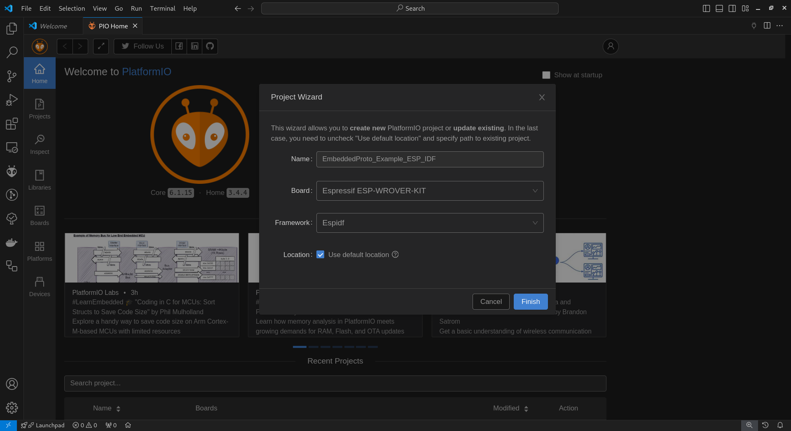

# Using Embedded Proto with ESP32 in PlatformIO

This repository features a demo project showcasing the use of the Embedded Proto library in an ESP32 PlatformIO environment. You can explore the demo to experiment with the code and test it on your own board. Additionally, the tutorial provided will guide you step-by-step in creating a similar project from scratch.

## Demo

To try out the demo provided in this repository and run it on your board, follow these steps:

### Clone the repository and open the project in VSCode

```bash
# Clone the repository
git clone https://github.com/Embedded-AMS/EmbeddedProto_Example_ESP_IDF.git

# Initialize the Embedded Proto submodule
cd EmbeddedProto_Example_ESP_IDF
git submodule update --init --recursive

# Open the project in VSCode
code .
```

VSCode will recommend for you to install PlatformIO extension if it's not already installed.

PlatformIO will start downloading and installing all the needed tools for the project.

## Tutorial

This tutorial will guide you through integrating the Embedded Proto library into your ESP32 PlatformIO project. Embedded Proto enables efficient serialization of data using protocol buffers, making it ideal for IoT applications where data size is critical. We'll walk through setting up the environment, integrating Embedded Proto, and automating protobuf compilation for smoother development.

By the end of this tutorial, you’ll have a working example that you can adapt to your own projects, leveraging the power of Embedded Proto to make your ESP32 applications more robust and efficient. You'll not only learn how to set up Embedded Proto in a PlatformIO project but also how to automate code generation from .proto files, ensuring that your protobuf definitions are always up to date.

## Prerequisites

Before you begin, ensure that you have the following tools installed:

- PlatformIO VSCode extension
- Python 3.x
- Protobuf compiler (protoc)

## Setting Up Embedded Proto in Your Own PlatformIO Project

This section will show you how to set up the Embedded Proto library from scratch in a new PlatformIO project. The steps below assume you're using an ESP32 device and the ESP-IDF framework.

### Step 1: Install the Protobuf Compiler

Embedded Proto uses protocol buffers, which require the `protoc` compiler to generate the code from `.proto` files.

1. Download the protoc compiler for Linux (adjust the version to match the Embedded Proto library's requirements):

```bash
wget https://github.com/protocolbuffers/protobuf/releases/download/v27.1/protoc-27.1-linux-x86_64.zip
```

2. Unzip the archive:

```bash
unzip protoc-27.1-linux-x86_64.zip -d protoc-27.1-linux-x86_64
```

3. Add the `protoc` binary to your system's `PATH` and refresh the environment:

```bash
cd protoc-27.1-linux-x86_64
echo 'export PATH="$PATH:$(pwd)"' >> ~/.bashrc
source ~/.bashrc
```

Now, your system is ready to generate protobuf files using `protoc`.

### Step 2: Create a New ESP32 PlatformIO Project

In PlatformIO, create a new project using the ESP32 microcontroller and the `Espidf` framework. This will create a new project and automatically install the `Espidf` framework and all the needed tools (building, flashing...).

1. Open PlatformIO and click on `New Project`.

2. Choose the target board (e.g., ESP32) and select `Espidf` as the framework.

3. If this is the first time you create an `Espidf` project on PlatformIO then it will take some time depending on your internet connection.



### Step 3: Add Embedded Proto Library

With the project created, we need to add the Embedded Proto library as a submodule:

1. Open the terminal in your project directory and run the following command to add Embedded Proto:

```bash
git submodule add https://github.com/Embedded-AMS/EmbeddedProto.git lib/EmbeddedProto
```

This command places the Embedded Proto library inside the `lib/` directory of your project.

### Step 4: Install Embedded Proto

Once the library is added, install it by running:

```bash
cd lib/EmbeddedProto
python setup.py
```

This ensures that all required dependencies for the Embedded Proto library are installed.

### Step 5: Generate Code from Your .proto File

To generate the C++ code from your protobuf definition, use the following command:

1. Ensure you are in your project root directory.

2. Use protoc to compile the node.proto file, specifying the Embedded Proto plugin:

```bash
protoc --plugin=protoc-gen-eams=lib/EmbeddedProto/protoc-gen-eams -I proto --eams_out=generated proto/node.proto
```

This will generate the appropriate C++ code from the .proto file, which you can then include in your project.

### Step 6: Automate the Protobuf Compilation with a Pre-Build Script

Instead of manually compiling your `.proto` files every time you make changes, you can automate this process by adding a pre-build script in PlatformIO.

#### 6.1. Reference the Pre-Build Script in `platformio.ini`

Add the following line to your `platformio.ini` file to reference the pre-build script:

```ini
extra_scripts =
    pre:scripts/pre_build.py
```

#### 6.2. Create the Pre-Build Script

Create a directory for your scripts and add a `pre_build.py` file:

```bash
mkdir scripts && cd scripts
touch pre_build.py
```

Then, add the following Python code to the `pre_build.py` script:

```python
import subprocess
import os

print("#####################################################################")
print("#                  Generating code for .proto file                  #")
print("#####################################################################")

# Check if the 'generated' directory exists, if not, create it
generated_dir = "generated"
if not os.path.exists(generated_dir):
    os.makedirs(generated_dir)
    print(f"Directory '{generated_dir}' created.")
else:
    print(f"Directory '{generated_dir}' already exists.")

# Define the protoc command
command = [
    "protoc",
    "--plugin=protoc-gen-eams=lib/EmbeddedProto/protoc-gen-eams",
    "-I",
    "proto",
    "--eams_out=generated",
    "proto/node.proto",
]

# Run the command
result = subprocess.run(command, capture_output=True, text=True)

# Output the result
if result.returncode == 0:
    print("Code generation successful.")
else:
    print("Error in code generation:")
    print(result.stderr)
```

This script will automatically run before each build, ensuring your protobuf files are always up-to-date.

### Explaining `main.cpp` code

The code in `main.cpp` responsible for connecting the ESP32 to a Wi-Fi network, synchronizing the system time using SNTP (Simple Network Time Protocol), and publishing temperature data to an MQTT broker at regular intervals. The data is serialized into a Protocol Buffers format using the EmbeddedProto library before being sent over the network.

#### 1. Including Necessary Libraries

```cpp
#include <esp_log.h>
#include <esp_wifi.h>
#include <esp_sntp.h>
#include <esp_netif.h>
#include <nvs_flash.h>
#include <freertos/FreeRTOS.h>
#include <mqtt_client.h>
#include "WriteBufferFixedSize.h"
#include "node.h"
```

These headers include essential ESP-IDF libraries for logging, WiFi, NTP, network interfaces, non-volatile storage (NVS), FreeRTOS, MQTT, and the EmbeddedProto-specific headers for serialization (WriteBufferFixedSize.h) and the protobuf message definition (node.h).

#### 2. MQTT and SNTP Configuration
```cpp
static constexpr const char* MQTT_BROKER_URI = "mqtts://test.mosquitto.org:8883";
static constexpr const char* MQTT_PUBLISH_TOPIC = "my/sensor/temperature/proto";
static constexpr uint32_t PUBLISHING_PERIOD_MS = 2000;
esp_sntp_config_t sntpConfig = ESP_NETIF_SNTP_DEFAULT_CONFIG("pool.ntp.org");
```

Here, you define constants for the MQTT broker's URI, the topic to which temperature data will be published, and the publishing period (2 seconds). The SNTP configuration points to a public NTP server to synchronize the device’s time.

#### 3. Initialize NVS and WiFi Connection

```cpp
ret = nvs_flash_init();
if ((ret == ESP_ERR_NVS_NO_FREE_PAGES) || (ret == ESP_ERR_NVS_NEW_VERSION_FOUND)) {
  ESP_ERROR_CHECK(nvs_flash_erase());
  ESP_ERROR_CHECK(nvs_flash_init());
}
ESP_ERROR_CHECK(esp_netif_init());
ESP_ERROR_CHECK(esp_event_loop_create_default());
ESP_ERROR_CHECK(example_connect());
ESP_ERROR_CHECK(esp_wifi_set_ps(WIFI_PS_NONE));
```

This snippet initializes the non-volatile storage (NVS) and handles any errors by erasing the storage if needed. It also initializes the network interface, event loop, and connects to WiFi.

4. Time Synchronization Using SNTP

```cpp
time(&timestamp);
localtime_r(&timestamp, &dateTime);

if (dateTime.tm_year == (1970 - 1900)) {
  sntpConfig.sync_cb = onTimeAvailable;
  esp_netif_sntp_init(&sntpConfig);
  xSemaphoreTake(syncSemaphore, portMAX_DELAY);
}
```

The device checks if the system time is already set. If not, it uses SNTP to synchronize the time. The onTimeAvailable callback is triggered when the time is successfully set, and the semaphore signals the application to proceed.

#### 5. MQTT Client Setup

```cpp
mqttConfig.broker.address.uri = MQTT_BROKER_URI;
mqttConfig.broker.verification.certificate = MQTT_BROKER_CERT_CRT_START;
mqttClient = esp_mqtt_client_init(&mqttConfig);
ESP_ERROR_CHECK(esp_mqtt_client_register_event(mqttClient, ESP_EVENT_ANY_ID, onMqttEvent, nullptr));
ESP_ERROR_CHECK(esp_mqtt_client_start(mqttClient));
```

This section configures the MQTT client, specifying the broker's URI and SSL certificate for a secure connection. The MQTT client is initialized, and the onMqttEvent callback is registered to handle various MQTT events, such as connection and disconnection.

#### 6. Temperature Data Simulation and Serialization

```cpp
while (true) {
  temperature = getFakeTemperature(TEMPERATURE_MIN_VALUE, TEMPERATURE_MAX_VALUE);
  nodeData.set_temperature(temperature);
  time(&timestamp);
  nodeData.set_timestamp(timestamp);

  if (nodeData.serialize(writeBuffer) == EmbeddedProto::Error::NO_ERRORS) {
    esp_mqtt_client_publish(mqttClient, MQTT_PUBLISH_TOPIC, reinterpret_cast<const char*>(writeBuffer.get_data()), writeBuffer.get_size(), 0, 0);
  }
  vTaskDelay(pdMS_TO_TICKS(PUBLISHING_PERIOD_MS));
}
```

Inside the main loop, a fake temperature value is generated and assigned to the nodeData protobuf message. The current timestamp is also set. The message is then serialized into a buffer using EmbeddedProto, and if serialization is successful, the data is published to the MQTT topic. The loop runs continuously with a delay of 2 seconds between each iteration.

#### 7. Handling MQTT Events

```cpp
static void onMqttEvent(void* args, esp_event_base_t eventBase, int32_t eventId, void* eventData) {
  esp_mqtt_event_handle_t event = static_cast<esp_mqtt_event_handle_t>(eventData);

  switch (static_cast<esp_mqtt_event_id_t>(eventId)) {
    case MQTT_EVENT_CONNECTED:
      xSemaphoreGive(syncSemaphore);
      break;
    case MQTT_EVENT_DISCONNECTED:
      ESP_LOGD(TAG, "MQTT_EVENT_DISCONNECTED");
      break;
    // Other cases handle various MQTT events
  }
}
```

The onMqttEvent function processes different MQTT events. For example, when the client successfully connects to the broker (MQTT_EVENT_CONNECTED), the semaphore is given, signaling that the connection is established. Other events like disconnection, subscription, and error handling are also managed within this function.

#### 8. Generating Fake Temperature

```cpp
static float getFakeTemperature(float min, float max) {
  float random_float = static_cast<float>(esp_random()) / UINT32_MAX;
  return min + random_float * (max - min);
}
```

This helper function generates a random temperature value within a specified range. The esp_random() function is used to generate a random 32-bit integer, which is then scaled to the desired range.

#### 9. Time Synchronization Callback

```cpp
static void onTimeAvailable(struct timeval* tv) {
  settimeofday(tv, NULL);
  xSemaphoreGive(syncSemaphore);
}
```

The onTimeAvailable callback is called when the time is synchronized via SNTP. It sets the system time and releases the semaphore to notify that the time is now available for use.

### Explaining `node.proto` code

This `node.proto` file defines our message in the Protocol Buffers (protobuf) format. It is written using proto3 syntax, which is the most recent version of Protocol Buffers. It defines a simple `Data` message with two fields:

- **`temperature`:** a floating-point value to store a temperature reading.
- **`timestamp`:** a 64-bit integer to store the time at which the data was recorded.

### Conclusion

By following this tutorial, you’ve set up Embedded Proto in a PlatformIO project for ESP32, integrated protobuf compilation into your workflow, and automated the build process. Embedded Proto helps you serialize data efficiently in embedded environments, and this setup will help streamline your development with ESP32 and IoT projects.
